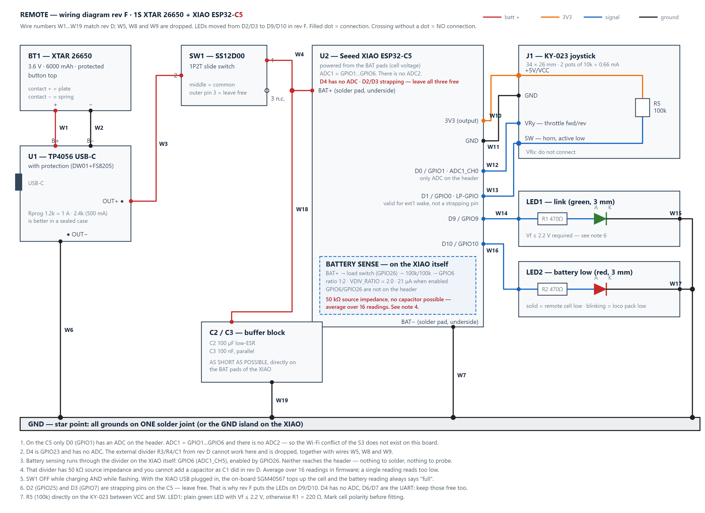

# Remote — wire list rev F (XIAO ESP32-**C5**)

Goes with [`hardware/wiring-remote.svg`](../hardware/wiring-remote.svg) and
[`firmware/remote/src/main.cpp`](../firmware/remote/src/main.cpp). Successor to rev D (S3).
The numbering W1–W19 is kept identical to rev D; **W5, W8 and W9 are dropped**.

> **Still building on the S3?** Then use rev D. This list breaks the battery measurement on an S3.
> The **locomotive now runs on a C5 as well** — see [`wiring-loco.md`](wiring-loco.md).
>
> **Rev F versus rev E:** the two LEDs move from D2/D3 to **D9/D10**. GPIO25 and GPIO7 are strapping
> pins on the C5; see "Strapping pins" below.

[](../hardware/wiring-remote.png)

## What changed compared to rev D

| Item | Rev D (S3) | Rev E/F (C5) | Why |
|------|-----------|-------------|-----|
| Battery sense | external divider R3/R4 + C1 → D4 | **divider on the XIAO itself** (GPIO6, enable GPIO26) | D4 is GPIO23 on the C5 and has no ADC |
| W5, W8, W9 | three wires | **dropped** | they belong to the external divider |
| R3, R4, C1 | in the BOM | **dropped** | idem |
| JOY_SW | D1 = GPIO2 | D1 = **GPIO0** | different board, same path |
| LED_LINK | D2 = GPIO3 | **D9 = GPIO9** | D2/GPIO25 is a strapping pin |
| LED_BATT | D3 = GPIO4 | **D10 = GPIO10** | D3/GPIO7 is a strapping pin |
| Wake from deep sleep | `esp_sleep_enable_ext0_wakeup()` | `esp_sleep_enable_ext1_wakeup()` | ext0 does not exist on RISC-V |
| Radio band | implicitly 2.4 GHz | **locked explicitly** to 2.4 GHz | the C5 is dual-band; both ends must be on the same band |

By **label** the pins sit in the same place. If you already soldered rev D, you do not need to move
any wire for the joystick or the LEDs — only remove the divider.

## Pinout, C5 versus S3

| Label | Net | S3 | C5 | Note on the C5 |
|-------|-----|----|----|----------------|
| D0 | JOY_Y | GPIO1 | GPIO1 | ADC1_CH0 — **the only ADC on the header** |
| D1 | JOY_SW | GPIO2 | **GPIO0** | LP-GPIO, valid for ext1 wake, not a strapping pin |
| D2 | — | GPIO3 | **GPIO25** | **strapping — leave free** |
| D3 | — | GPIO4 | **GPIO7** | **strapping — leave free** |
| D4 | — | GPIO5 | **GPIO23** | **no ADC** — do not use |
| D6/D7 | — | GPIO43/44 | **GPIO11/12** | UART — keep free |
| D9 | LED_LINK | — | **GPIO9** | ordinary digital output |
| D10 | LED_BATT | — | **GPIO10** | ordinary digital output |
| — | VSENSE | — | GPIO6 | divider on the XIAO, ADC1_CH5 |
| — | VSENSE_EN | — | GPIO26 | enables that divider, HIGH = on |

Source for the label mapping and the two battery pins: `variants/XIAO_ESP32C5/pins_arduino.h` in
arduino-esp32 (`D0=1 D1=0 D2=25 D3=7 D4=23`, `BAT_VOLT_PIN=6`, `BAT_VOLT_PIN_EN=26`).

## Strapping pins — why the LEDs moved

Strapping pins on the ESP32-C5 are **GPIO2, GPIO7, GPIO25, GPIO27 and GPIO28**. On the XIAO header
those are **D3 (GPIO7)** and **D2 (GPIO25)** — exactly where rev E had the two LEDs.

Why that is a bad idea: at reset the GPIO is high-Z and the chip reads the pin level for about 3 ms.
With an LED and 470 Ω to ground attached, the pin settles at roughly the forward voltage of the LED,
about 1.9 V. That sits between the thresholds for low (~0.8 V) and high (~2.5 V), so what the chip
reads is undefined.

The boot mode itself depends on GPIO26/27/28 and not on these two, so the odds of the board failing
to start are small. But D9 and D10 are free on this board as ordinary GPIOs, so there is no reason to
take the risk. **Move two wires and be done.**

If you already soldered rev E: move W14 from D2 to D9, and W16 from D3 to D10. The firmware in
`main.cpp` is already on the new pins.

## The battery measurement — read this before soldering

**The C5 has only one ADC unit.** ADC1, six channels, on GPIO1 through GPIO6. There is **no ADC2**.
Two consequences:

1. The Wi-Fi/ADC2 conflict that applied on the S3 does not exist on this board. The warning from
   rev D does not apply here.
2. Of the header pins, only **D0 (GPIO1)** can measure analog. So the joystick Y axis has to sit
   there — there is no alternative. D4 (GPIO23) has no ADC hardware, so the external divider from
   rev D cannot work on this board. That is why it is dropped; it is not a software choice.

The XIAO C5 has the measurement on board: **BAT+ → load switch (GPIO26) → 100 kΩ / 100 kΩ → GPIO6**.
Ratio **1:2**, so `VDIV_RATIO = 2.0f`. The enable is **active high**.

> The two open items from the previous version of this list are hereby closed: `VDIV_RATIO 2.0f` is
> correct (it happens to be the same ratio as the dropped external 100k/100k divider), and
> `digitalWrite(BAT_VOLT_PIN_EN, HIGH)` is the right polarity.

### What does need attention

**The source impedance has not disappeared, it has only become unreachable.** 100 kΩ ∥ 100 kΩ =
50 kΩ, exactly the same 50 kΩ that made C1 (100 nF) necessary in rev D. GPIO6 does not reach the
header, so you **cannot** add a capacitor now. The only remedy is in firmware: **average over 16
readings**. Seeed recommends this in their own example too, on the grounds that transmitting puts
spikes on the reading. The firmware does that now; a single reading every 2 s reads structurally too
low.

**You cannot verify the measurement with a multimeter.** In rev D the check table said "measure the
divider tap on D4 = exactly half of BAT+". That point no longer exists. That is why the firmware
prints a calibration line over USB every 2 seconds:

```
cell 3847 mV (pin 1923 mV, ratio 2.000 x cal 1.000) | loco 7620 mV
```

Calibrate like this — USB may stay plugged in:

1. Cell fitted, **SW1 on**, XIAO USB into the PC, serial monitor open at 115200.
2. Put a multimeter on **BAT+ relative to GND** and read the printed cell value at the same moment.
3. `VDIV_CAL = multimeter / printed cell value`. Put that value in `main.cpp` and reflash.
4. Verify with a second reading at a different cell voltage.

That the SGM40567 is topping up the cell at that moment makes no difference for **calibration**: the
multimeter and the on-board divider measure the same node at the same time, so the charge current
cancels out. It only matters for the **absolute** value — see below.

Two 100 kΩ resistors are typically ±1 %, so the ratio can be off by up to ~2 % — at 4.2 V that is
~84 mV. For a threshold at 3300 mV that is not dramatic, but it does decide whether the red LED comes
on too early or too late.

**With the XIAO USB plugged in you read the charge voltage, not the resting voltage.** The on-board
SGM40567 then tops up the cell and pulls BAT+ towards 4.2 V. The battery measurement therefore always
reads "full" and the red LED never comes on. For functional testing (joystick, link, LEDs, packets)
that is no problem, and for calibrating `VDIV_CAL` it is not either. If you want to see the **resting
voltage** or test the low-battery threshold, unplug USB — or use a USB cable with the 5 V conductor
cut (data only), which keeps the COM port working while the XIAO runs off the cell.

With **SW1 off** and USB plugged in you do get serial output, but BAT+ is disconnected from the cell.
The reading is then meaningless: the charger is driving an open node. Fine for flashing, not for
measuring.

**The divider is pinched off in deep sleep.** The firmware drives GPIO26 low and latches it with
`gpio_hold_en()` just before `esp_deep_sleep_start()`; on wake, `gpio_hold_dis()` comes first in
`setup()`. That saves the 21 µA the 100k/100k would otherwise draw permanently. Check on the first
build whether that really works: measure the deep-sleep current. If you end up ~21 µA above
expectation, the hold is not taking.

## Order of assembly

1. W3–W19 first: power, ground, signals, buffer block.
2. **W1–W2 (cell → TP4056) last.** As long as the cell is not connected, nothing can be damaged.
3. Checks below, and only then fit the cell.

## Wire list

| # | Net | From | To | Colour | Wire |
|---|-----|------|----|--------|------|
| W1 | CELL+ | BT1 positive contact (plate) | U1 TP4056 **B+** | red | AWG20–22 |
| W2 | CELL− | BT1 negative contact (spring) | U1 TP4056 **B−** | black | AWG20–22 |
| W3 | VBAT | U1 TP4056 **OUT+** | SW1 **pin 2** (middle) | red | AWG22 |
| W4 | VBAT_SW | SW1 **pin 1** (outer) | U2 XIAO **BAT+** pad (underside) | red | AWG24–26 |
| ~~W5~~ | ~~VBAT_SW~~ | — | — | — | **dropped** (divider) |
| W6 | GND | U1 TP4056 **OUT−** | GND star point | black | AWG22 |
| W7 | GND | U2 XIAO **BAT−** pad (underside) | GND star point | black | AWG24–26 |
| ~~W8~~ | ~~GND~~ | — | — | — | **dropped** (divider) |
| ~~W9~~ | ~~VSENSE~~ | — | — | — | **dropped** (divider) |
| W10 | 3V3 | U2 XIAO **3V3** | J1 KY-023 **+5V/VCC** | orange | AWG26 |
| W11 | GND | U2 XIAO **GND** | J1 KY-023 **GND** | black | AWG26 |
| W12 | JOY_Y | J1 KY-023 **VRy** | U2 XIAO **D0 / GPIO1** | blue | AWG26 |
| W13 | JOY_SW | J1 KY-023 **SW** | U2 XIAO **D1 / GPIO0** | blue | AWG26 |
| W14 | LED_LINK | U2 XIAO **D9 / GPIO9** | R1 → LED1 **anode** (green) | blue | AWG26 |
| W15 | GND | LED1 **cathode** (short leg) | GND star point | black | AWG26 |
| W16 | LED_BATT | U2 XIAO **D10 / GPIO10** | R2 470 Ω → LED2 **anode** (red) | blue | AWG26 |
| W17 | GND | LED2 **cathode** (short leg) | GND star point | black | AWG26 |
| W18 | VBAT_SW | C2/C3 positive side | XIAO **BAT+** pad — **as short as possible** | red | AWG24 |
| W19 | GND | C2/C3 negative side | XIAO **BAT−** pad — **as short as possible** | black | AWG24 |

**Do not connect:** SW1 pin 3, KY-023 VRx, XIAO **D2, D3, D4, D6, D7**, and all remaining XIAO pins.

**R5 (100 kΩ)** is not a wire: solder it directly on the KY-023 between the pins **VCC** and **SW**.
**C2/C3** belong physically on the BAT pads of the XIAO itself; W18/W19 are only in the list to make
the topology unambiguous — they are not 10 cm flying leads.

## Parts

Compared to rev D, **R3, R4 and C1 are dropped.** The rest stays:

| Part | Value | Reason |
|------|-------|--------|
| C2 | 100 µF low-ESR electrolytic (≥ 6.3 V) | ESP-NOW draws peaks of 250–350 mA. Cell → protection FETs → slide switch → thin wire gives a 50–150 mV dip. With a nearly empty cell the XIAO then drops through its brownout — exactly when the low-battery warning should be working. |
| C3 | 100 nF ceramic | HF decoupling in parallel with C2. |
| R5 | 100 kΩ | External pull-up on D1. The internal pull-up disappears as soon as the chip enters deep sleep; without R5, D1 floats and waking on a joystick press is unreliable. |

Alternative to R5 without an extra part: `rtc_gpio_pullup_en(GPIO_NUM_0);` just before
`esp_deep_sleep_start()`. **Watch the pin number:** rev D said `GPIO_NUM_2`, which was the S3.

## Operating rules

1. **SW1 OFF while charging.** OUT+ and B+ are the same track on the TP4056, so it sees the load of
   the XIAO (~80–100 mA) as charge current. The termination threshold (≈C/10 = 100 mA at 1 A) is then
   never reached; the CHRG LED never goes out and the cell stays at 4.2 V.
2. **SW1 OFF while flashing.** The cell is then disconnected from BAT+ and USB powers only the XIAO.
   That way two chargers never work on the same cell at once, and you do not accidentally measure the
   charger instead of the cell.
3. **Check cell polarity before fitting.** The printed bay accepts the 26650 the wrong way round too.
   With reversed polarity the body diodes in the FS8205 conduct and the TP4056 is destroyed; the
   protection inside the cell does not prevent that.

## Checks before connecting the cell

1. Continuity check OUT+ → XIAO BAT+ with SW1 on; **no** continuity with SW1 off.
2. Resistance between OUT+ and OUT−: expect **> 100 kΩ**, not "infinite" — the module has internal
   paths (DW01 supply, status LEDs).
3. The divider check from rev D is **dropped**; there is no external divider any more and GPIO6 is
   not reachable.
4. Only then solder W1/W2 and fit the cell — with the polarity verified.

## Checks after switching on

| Test point | Expected | Cross-check |
|------------|----------|-------------|
| XIAO BAT+ relative to GND | cell voltage, 3.0–4.2 V | multimeter — this is your calibration reference |
| printed cell value over USB | within ~2 % of the multimeter | otherwise adjust `VDIV_CAL` |
| XIAO 3V3 | 3.25–3.35 V | internal LDO |
| KY-023 VRy at rest | ± 1.65 V | half of 3V3; the firmware calibrates the centre at boot — **release the stick during boot** |
| LED current | 2.5–3.0 mA per LED | (3.3 V − Vf) / 470 Ω, with Vf ≈ 1.9–2.2 V |
| consumption, SW1 off | a few tens of µA | leakage of TP4056/DW01 only — measure it, do not assume |
| consumption, on + deep sleep | about 0.7 mA | dominated by the 0.66 mA of the two 10k pots of the KY-023 on 3V3. If there is ~21 µA on top of that, the hold on GPIO26 is not taking and the cell divider keeps running. |

On 6000 mAh, 0.7 mA is about 10 months of standby. If you want it lower: feed the KY-023 from a GPIO
instead of 3V3. In that case **R5 must no longer be on the module** but as a discrete resistor from
the fixed 3V3 to D1 — otherwise the pull-up dies with the module supply and the wake stops working.

## Still open — not the battery measurement

**The throttle stick is asymmetric.** VRy runs 0–3.3 V, but the ADC saturates below 3.3 V.
`joyCenter` therefore ends up above 2048 while `readThrottle()` divides hard by 2048: forward never
reaches full throttle, reverse hits −1000 before the end stop. This is **not yet** in the firmware.
Scaling per direction fixes it:

```c
long v = (a > joyCenter) ? (a - joyCenter) * 1000L / (4095 - joyCenter)
                         : (a - joyCenter) * 1000L / joyCenter;
```

**Green LED.** 470 Ω is right for red (Vf ≈ 1.9 V → 3.0 mA). A bright green InGaN LED has
Vf ≈ 3.0–3.2 V and barely lights up on 3.3 V through 470 Ω. Use one with Vf ≤ 2.2 V, or R1 = 220 Ω.

**The TP4056 at 1 A** dissipates ≈1.8 W inside a sealed PETG case. Rprog 1.2 kΩ → 2.4 kΩ makes it
500 mA (charge time ≈13 h).

## Radio

The C5 is dual-band (Wi-Fi 6, 2.4 + 5 GHz). The firmware therefore locks the band explicitly with
`esp_wifi_set_band_mode(WIFI_BAND_MODE_2G_ONLY)` before `esp_wifi_set_channel()`. Without that line
channel 1 can end up on the 5 GHz band and the locomotive sees nothing. The ESP-NOW protocol is
unchanged: same `MAGIC`, same packet layout, channel 1.

## Build environment

The C5 is only supported from Arduino-ESP32 core 3.3 / IDF 5.5 onwards. `platformio.ini` therefore
points at pioarduino 55.03.311. That requires PlatformIO Core ≥ 6.1.19; if the `pio` on your PATH is
older, call the one in `%USERPROFILE%\.platformio\penv\Scripts\pio.exe`.

## Sources

- Pin mapping and battery pins: `variants/XIAO_ESP32C5/pins_arduino.h`, arduino-esp32
- ADC1 channels (GPIO1–6, one ADC unit) and LP_GPIO0–LP_GPIO6: ESP32-C5 datasheet, Espressif
- Strapping pins GPIO27/GPIO28: esptool "Boot Mode Selection — ESP32-C5", Espressif
- On-board divider 2× 100 kΩ, 1:2, `BAT_VOLT_PIN_EN` high, range 0–3300 mV: Seeed Studio wiki,
  "Getting Started with Seeed Studio XIAO ESP32-C5"
- 16× averaging against spikes while transmitting: Seeed Studio wiki, "How to check the battery
  voltage"
- Strapping pins GPIO2/7/25/27/28: Espressif ESP-IDF "GPIO & RTC GPIO — ESP32-C5" and the hardware
  design guidelines schematic checklist
